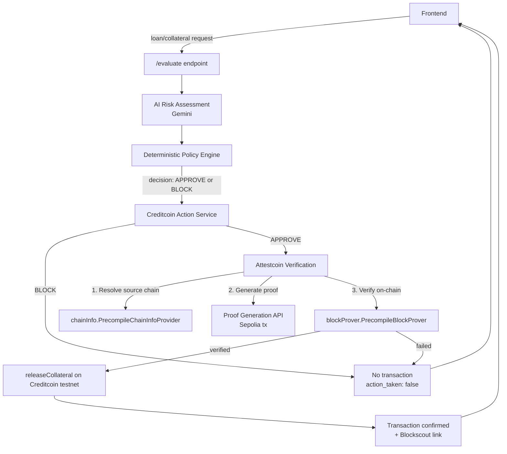

# CreditGuard AI

An AI-powered collateral release system built on Creditcoin, using the **Attestcoin Protocol** to cryptographically verify cross-chain events before any funds move.

Built for BUIDL CTC 2026 Fall.

---

## What it does

CreditGuard AI evaluates loan/collateral decisions using an AI risk model layered on top of deterministic policy rules, then executes the resulting action (release or block collateral) on Creditcoin testnet — but only after independently verifying, via the Attestcoin Protocol, that the real-world event triggering the release (e.g. a borrower's repayment on another chain) actually happened. No action is taken on unverified claims.

---

## Architecture



**Flow summary:**
1. **Frontend** submits a request to `/evaluate`.
2. **AI risk assessment** (Gemini) produces a risk evaluation; a **deterministic policy layer** makes the final APPROVE/BLOCK call — the AI cannot override hard policy rules.
3. On **BLOCK**, no blockchain transaction occurs.
4. On **APPROVE**, before any funds move, the **Attestcoin Protocol** verifies that the underlying real-world/cross-chain event genuinely happened:
   - Confirms the source chain (e.g. Ethereum Sepolia) is supported
   - Generates a Merkle + continuity proof for the relevant source-chain transaction
   - Submits that proof to Creditcoin's on-chain verifier precompile
5. Only if verification succeeds does `releaseCollateral()` execute on the Creditcoin testnet contract.
6. The frontend displays the decision, the verification evidence, and a link to the confirmed transaction on Blockscout.

---

## Project structure

```
CreditGuard-AI/
├── backend/
│   ├── main.py                      # AI evaluation service (/evaluate)
│   ├── routes/
│   ├── schemas/
│   ├── services/
│   ├── tests/
│   └── creditcoin-action-service/   # Node.js Creditcoin action + Attestcoin verification
│       ├── server.js
│       ├── creditcoinService.js
│       ├── attestcoinVerification.js
│       ├── .env.example
│       └── package.json
├── contracts/                       # Solidity contracts (releaseCollateral, Attestcoin verifier)
├── verification/                    # Attestcoin proof/verification scripts
├── frontend/
└── agents/
```

---

## Setup

### Prerequisites
- Node.js v18+
- Python 3.10+ (for the AI evaluation service)
- A funded Creditcoin testnet wallet [faucet](https://cloud.google.com/application/web3/faucet/ethereum/sepolia)
- A Sepolia testnet transaction to use as verification evidence (for testing)

### Creditcoin Action Service

```bash
cd backend/creditcoin-action-service
npm install
cp .env.example .env
```

Fill in `.env`:
```
RPC_URL=https://rpc.cc3-testnet.creditcoin.network/
PRIVATE_KEY=<your testnet wallet's private key>
CONTRACT_ADDRESS=<deployed CreditGuardAction contract address>
PROVER_API_URL=https://proof-gen-api.cc3-testnet.creditcoin.network/
PORT=4000
```

**Never commit `.env`.** It's already git-ignored.

Start the service:
```bash
npm start
```

### AI Evaluation Service (`/evaluate`)

```bash
cd backend
pip install -r requirements.txt
python main.py
```

---

## Testing

**BLOCK case** — no blockchain transaction:
```bash
curl -X POST http://localhost:4000/creditcoin-action \
  -H "Content-Type: application/json" \
  -d '{"decision": "BLOCK"}'
```

**APPROVE case** — real testnet transaction, gated on Attestcoin verification:
```bash
curl -X POST http://localhost:4000/creditcoin-action \
  -H "Content-Type: application/json" \
  -d '{"decision": "APPROVE", "borrower_wallet_address": "0x...", "amount_usdc": 500}'
```

Both are verifiable on [Creditcoin Testnet Blockscout](https://creditcoin-testnet.blockscout.com/).

---

## Attestcoin Protocol integration

Attestcoin verification lives in `backend/creditcoin-action-service/attestcoinVerification.js`. Given a source-chain transaction hash, it:

1. Confirms the chain is supported (`chainInfo.PrecompileChainInfoProvider`)
2. Generates a proof via Creditcoin's hosted Proof Generation API (`proofProvider.service.ProofBuilder`)
3. Verifies that proof on-chain via the Block Prover precompile (`blockProver.PrecompileBlockProver`)
4. Only returns success if on-chain verification passes — callers must treat any failure as "do not release funds"

This was tested end-to-end against a real Ethereum Sepolia transaction, with the resulting verification transaction confirmed on Creditcoin testnet Blockscout.

---

## Team

| Name | Role |
|---|---|
| Hadi | Creditcoin contract, action endpoint, Attestcoin integration |
| Thamannah | Integration, team coordination, end-to-end testing |
| Asad | AI/policy evaluation logic, validation, test scenarios |
| Anha | Frontend, UX, evidence display |

---

## License

[Add license]